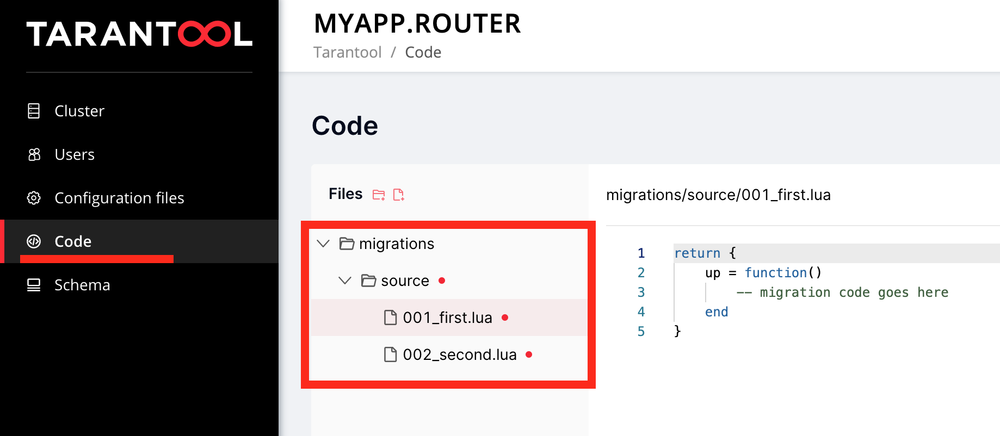

# Migrations manager for Tarantool Cartridge

@lookup README.md

Migrations module allows you to run cluster-wide migrations for your data.

It stores the list of applied migrations in cluster-wide config and applies resulting schema to cartridge `ddl`.

## Usage

1)  Add `migrations` dependency:
    ```lua
    -- <project-name>-scm-1.rockspec
        dependencies = {
            ...
            'migrations == <the-latest-tag>-1',
            ...
        }
    ```

2) Add `migrator` to the list of cartridge roles in `init.lua`:
    ```lua
    -- init.lua
    ....
    cartridge.cfg({
      roles = {
        'migrator',
        ....
      }
    })
    ```

3) Put migrations code to `./migrations` folder in your app. By default, migrator loads all files from it using lexicographical order.
Every migration (e. g. `0001_create_my_sharded_space_DATETIME.lua`) should expose a single parameter-less function `up`:
    ```lua
    return {
        up = function()
        local utils = require('migrator.utils')
        local f = box.schema.create_space('my_sharded_space', {
            format = {
                { name = 'key', type = 'string' },
                { name = 'bucket_id', type = 'unsigned' },
                { name = 'value', type = 'any', is_nullable = true }
            },
            if_not_exists = true,
        })
        f:create_index('primary', {
            parts = { 'key' },
            if_not_exists = true,
        })
        f:create_index('bucket_id', {
            parts = { 'bucket_id' },
            if_not_exists = true,
            unique = false
        })
        utils.register_sharding_key('my_sharded_space', {'key'})
        return true
        end
    }
    ```

4) Call `curl -X POST http://<your_tarantool_ip>:<http_port>/migrations/up` once you are ready to migrate or connect to any instance of cluster and call `require('migrator').up()`.

5) What will happen then:
    * coordinator node (the one you curled upon) will trigger migrations execution on all replicaset leaders;
    * each replicaset leader will apply all available migrations and reply to coordinator;
    * if all replies are sussessful, coordinator will apply changes to cluster-wide config - a list of applied migrations and (optionally) resulting ddl-schema.

6) That's it!

## Advanced usage

IMPORTANT: code snippets below should be embedded to `init.lua`, so they would take effect on all nodes of the cluster.

1) Change directory where migrations are located: embed the following to init.lua

    ```lua
    local migrator = require('migrator')
    local my_directory_loader = require('migrator.directory-loader').new('test/integration/migrations')
    migrator.set_loader(my_directory_loader)
    ```

2) ... or use `migrator.config-loader` to load migrations from Tarantool Cartridge clusterwide config.

    Configure `migrator` to use `config-loader`:

    ```lua
    local migrator = require('migrator')
    local config_loader = require('migrator.config-loader').new()
    migrator.set_loader(config_loader)
    ```

    Navigate to Cartridge webui "Code" to write your migrations.
    Migrations must be stored in *.lua files under "migrations/source" key:

    

3) ... or use your own loader - it should expose a single function `list(self)` which returns a similar-looking array:

    ```lua
    local my_loader = {
        list = function(_)
            return {
                {
                    name  = '01_first',
                    up = function() ... end
                },
            }
        end
    }
    migrator.set_loader(my_loader)
    ```

4) Disable `cartridge.ddl` usage:

    ```lua
    migrator.set_use_cartridge_ddl(false)
    ```

    In this case, resulting schema will not be registered via `cartridge_set_schema`

## Utils, helpers, tips and tricks
* Specify a sharding key for `cartridge.ddl` (if you use it) using `utils.register_sharding_key`:
```lua
    up = function()
        local utils = require('migrator.utils')
        local f = box.schema.create_space('my_sharded_space', {
            format = {
                { name = 'key', type = 'string' },
                { name = 'bucket_id', type = 'unsigned' },
                { name = 'value', type = 'any', is_nullable = true }
            },
            if_not_exists = true,
        })
        f:create_index('primary', {
            parts = { 'key' },
            if_not_exists = true,
        })
        f:create_index('bucket_id', {
            parts = { 'bucket_id' },
            if_not_exists = true,
            unique = false
        })
        utils.register_sharding_key('my_sharded_space', {'key'})
        return true
    end
```
Warning! It's not correct to specify 'bucket_id' as a 'key' parameter for register_sharding_key().
The 'bucket_id' field is a place where the output of sharding function is saved to.


## Limitations
- all migrations will be run on all cluster nodes (no partial migrations);
- no pre-validation for migrations code (yet), so you should test them beforehands;
- no support to run a single migration (yet);
- no dry-run (yet);
- no rolling back unsuccessful migrations (yet);
- no migrating `down` (yet).
